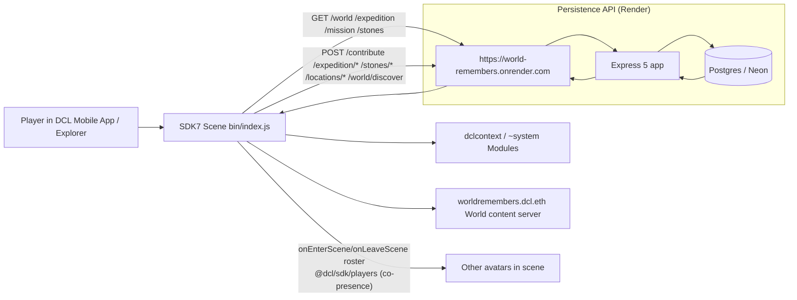

# The World Remembers — Architecture

A persistent, mobile-first social garden built on **Decentraland SDK7**. The
scene is a single 12×12-parcel World; almost everything a player does writes a
row to a **Postgres backend** and renders only what the server confirms. The
world "remembers" because its persistence API is the load-bearing spine, not
a decoration.

## System diagram

Layers:

- **Scene runtime (SDK7)**: `src/index.ts` wires entities, systems and UI.
  Pure, engine-free game-feel modules (`presence-core`, `trail-core`,
  `navigation`) live apart from `@dcl/sdk/ecs` so they run under plain Node
  tests.
- **HTTP provider (`src/http-provider.ts` + `state.ts`)**: validates every
  server payload with strict parsers before it can mutate the scene. In-flight
  guards prevent duplicate requests.
- **Backend (`backend/`)**: an Express 5 app whose only job is to make
  *derived* state from persistent rows. Everything a client can read is either
  a count that exists in Postgres or a value recomputed from it. No client
  ever submits a number that becomes authoritative.

## The core value flow (the spine)

1. **Enter** — scene loads `GET /world`; derives tree stage, world memory
   level, lighthouse stage, daily event, rare-memory pointer.
2. **Act** — a tap is `POST /contribute` with the player's DCL session identity
   (`0x…` address, no wallet prompt). Server inserts exactly one row and
   returns the *new* derived stage + mission progress in the same response.
3. **Remember** — memory stones (`POST /stones/:id/memories`) and location
   reactions (`POST /locations/:id/memories`) are written with a whitelisted
   reaction and a DB `UNIQUE(player, target)` constraint (one per player).
4. **Expedition** — `GET /expedition` returns today's *deterministic* realm +
   3 fragment route (seed = FNV-1a of `dayKey:worldId`, never stored).
   `POST /expedition/dispel` → `collect` → `complete` are each server-validated
   (day, realm, guardian cleared, no duplicates).
5. **Payoff** — only server-confirmed state triggers visuals (tree pulse,
   restoration wave, bloom). Co-presence (`@dcl/sdk/players` roster, 0.5s tick)
   amplifies the payoff **additively** when other avatars are near the tree; it
   never gates a solo player.

## Why persistence is load-bearing, not decorative

The theme is a **mobile-first social experience** judged on "would you invite
your friends, would you stay, would you come back tomorrow." Strip the
backend and the build stops being this product:

| After removing the persistence API (`.onrender.com` + Postgres) | What happens |
|---|---|
| **Tree growth / stage** (`GET /world`, `POST /contribute`) | No contributions are retained; the tree stays DORMANT forever and never blooms. The whole "every tap helps the tree grow" loop is dead. |
| **Memory Stones** (`/stones/*`) | No visitor history; "who was here before you" vanishes. |
| **Daily Memory Expedition** (`/expedition`) | Fragments never spawn, guardians never clear, "come back tomorrow" has nothing to return to. |
| **World Memory Level / Lighthouse** (`GET /world`) | Community-derived progression (THE SLEEPING WORLD → THE REMEMBERED WORLD, FOUNDATION → BEACON) is frozen at empty. |
| **Mission / restoration + co-presence proof** | "N explorers restored it together" and the shared amplifier lose their numbers; the social proof reads as fake. |

Without the backend the World is a static garden — pretty, but with **zero
retained memory**, which is the exact opposite of the product's name and
the Friendzone theme.

## Removing the co-presence amplifier (a *soft* dependency, by design)

Co-presence (`src/presence-core` + `social-presence`, Phase K) is explicitly
**additive** — the README and tests treat it as "solo-safe." If removed, solo
play is unchanged; only the shared moment is less warm. This is deliberate and
documented so a judge can see the wager: the social amplifier is a free bonus
on a solo loop, not a hidden gate.

## Key modules

| Module | Responsibility |
|---|---|
| `src/index.ts` | Entry: wires providers, systems, UI |
| `src/config.ts` | All world-state config + the single `API.baseUrl` |
| `src/http-provider.ts` | HTTP client + strict response validators |
| `src/state.ts` | Provider interface, applyWorldState, in-flight guard |
| `src/tree.ts`, `src/garden.ts`, `src/stones.ts` | Entities + interactions |
| `src/expedition.ts`, `src/fragments.ts` | Daily expedition + guardian visuals |
| `src/living-world.ts`, `src/world-evolution.ts`, `src/lighthouse.ts` | Living-world rendering |
| `src/presence-core.ts`, `src/social-presence.ts` | Co-presence counting + amplifier |
| `src/interaction.ts` | Contextual proximity CTA manager (0.5s tick) |
| `src/ui.tsx` | Mobile-first react-ecs UI |
| `shared/*` | Single source of truth (stages, realms, expedition, whitelists) |
| `backend/` | Express 5 + Postgres persistence API |
| `scripts/*` | GLB validation, QR tooling, security scan, verification |